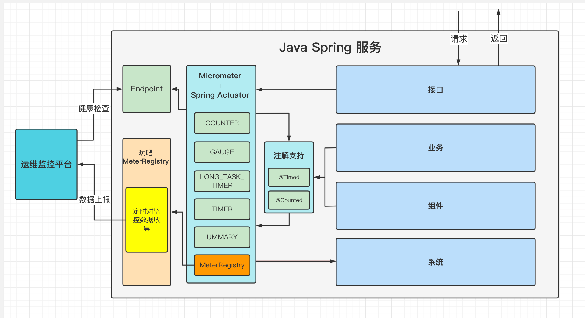

# l-monitor
基于micrometer实现监控组件，支持JVM、接口调用、DB执行、自定义监控等，可扩展缓存等监控

Spring服务引包即可享用以下监控：
所有接口的监控

请求次数【服务维度、接口维度、来源维度】

请求时间【平均、最大、P50\P90\P95\P99\P999】

HTTP请求状态

请求来源

接口自定义异常【异常类型、code】

应用服务容器监控

CPU与核数

GC【YGC、FGC】

GC时间【平均、最大】

GC次数

内存【最大、当前、可用】
Old
Edn
Sur
Metaspace
压缩类空间
代码缓存
JVM线程
最大、当前、守护
线程状态【new、waiting、runnable、blocked、terminated】
Tomcat
线程【最大、当前、繁忙】
Session【数量、时间、创建与拒绝】
Global【缓存、流量】
Jetty线程
最大、当前、最小
活跃、空闲
队列长度

通过SpringBean方式注入的线程池
线程数【最大、当前】
核心线程数
队列长度
执行情况【执行次数、执行中线程数、平均执行时间、最大执行时间、平均等待时间、最大等待时间】

业务自定义监控使用
名词解释

tag：每个监控指标中的维度标签，每个tag都有key与value。例如：扣钱业务，对于扣钱结果可以设置一个 key 叫 deductMoneyResult，value 有[success,fail]的tag；

注解方式注意事项

注解方式，在同类不同方法相互调用时，会只保留调用方的监控统计；
RPC接口默认支持监控统计，不需要额外增加注解；
tag将会在监控大盘上作为查询指标显示，因此禁止将uid这种不可控变量作为tag-value使用；
字符串方式的String... tags，使用注意：value一定不能为空！
每分钟统计一次；
支持监控统计类型

计数 Counter，支持 注解 与 Client

时间 Timer，支持 注解 与 Client
采样 Sampler
线程池监控
使用方式：
一、注解方式
@Timed

/**
* @Timed注解方式，tags支持SPEL表达式，值必须可控，不能是uid
* @param param
* @return
  */
  @Timed(value = WbMonitorCounterKeys.COUNTER_KEY_1, extraTags = {"tag-key", "#param"})
  public long timerDemo(String param) {}
  @Counted

/**
* @Counted注解方式，tags支持SPEL表达式，值必须可控，不能是uid
* @param param
* @return
  */
  @Counted(value = "counterDemo", extraTags = {"tag-key", "#param"})
  public long counterDemo(String param) {}

二、WbMonitor方式
通过枚举管理业务监控指标，注：业务自己实现枚举，不在公共包中维护

Counter 展开源码
Timer 展开源码

Counter

/**
* 计数类监控统计，每分钟统计一次，推送至Ops-Grafana监控平台，可在Ops后台进行
  */
  WbMonitor.count(WbMonitorCounterKeys.COUNTER_KEY_1, "tag-key", "tag-value");
  Timer

支持统计指标：count、max、avg、p50、p90、p99、p999
支持分段统计：通过split可在timer整体统计内进行额外的监控统计

Timer: try-with-resources

try (WbMonitor.WbTimer wbTimer = WbMonitor.start(WbMonitorTimerKeys.TIMER_KEY_1, "tag-key", "tag-value")) {
/**
* 业务逻辑1 xxx
* 对 WbMonitorTimerKeys.TIMER_KEY_1 拼上 -segment1，监控统计 业务逻辑1
  */
  wbTimer.split("-segment1");
  /**
* 业务逻辑2 xxx
* 对 WbMonitorTimerKeys.TIMER_KEY_1 拼上 -segment2，监控统计 业务逻辑2
  */
  wbTimer.split("-segment2");
  }
  Timer: start->xxx->stop

WbMonitor.WbTimer wbTimer = WbMonitor.start(WbMonitorTimerKeys.TIMER_KEY_1, "tag-key", "tag-value");
try {
//xxx
} finally {
wbTimer.stop();
}
Sampler: sampler

WbMonitor.sampler(WbMonitorSamplerKey.SAMPLER_KEY, xxx);
WbMonitor.samplerMapSize(WbMonitorSamplerKey.SAMPLER_KEY, map);
WbMonitor.samplerCollectionSize(WbMonitorSamplerKey.SAMPLER_KEY, collection);
三、线程池监控
通过Bean方式创建的线程池自动监控

ExecutorService executorService = WbMonitor.getMonitorExecutorService(
"testPool",
new ThreadPoolExecutor(5, 10, 10, TimeUnit.SECONDS, new LinkedBlockingDeque<>(1000))
);